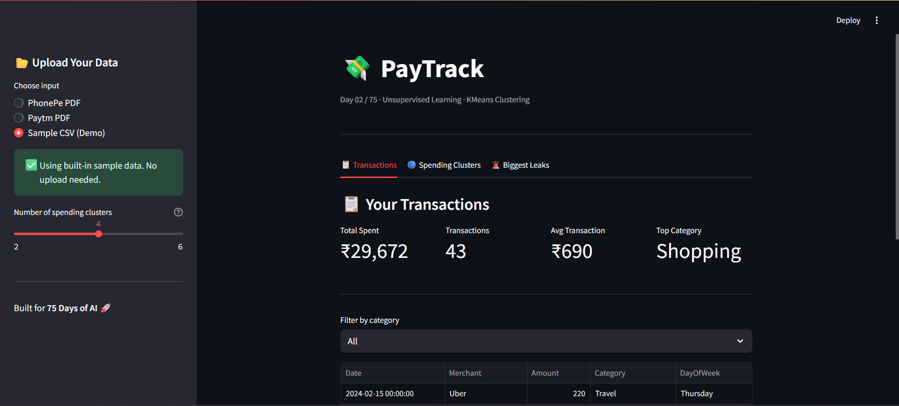

# PROBLEM 2 / 75
# 💸 PayTrack — UPI Spend Analyzer with KMeans Clustering
### Unsupervised Learning
### Find where your money is leaking — automatically.
### No labels needed. Patterns emerge from the data.

[](#)
[](https://python.org)
[](LICENSE)

---

## 😤 Why I Built This

Har mahine ka yahi hai — salary aati hai, khatam ho jaati hai. Pata nahi kahan jaata hai paisa.

PhonePe statement download karti thi — 200+ transactions ka PDF. "Main baad mein dekh lungi" bolti thi. Kabhi dekha nahi. Manually parsing? Forget it.

Budget apps tried kiye. Manual entry. Category tagging. Boring. Time-consuming. Dropped after 2 days.

So I did what any engineer should — I built my own. An analyzer that takes my *actual* UPI PDF, extracts every transaction, finds spending patterns using **KMeans clustering**, and tells me *exactly* where the biggest leaks are — completely automatically.

This is that app.

---

## 🧠 What is KMeans Clustering?

KMeans is an **unsupervised learning** algorithm that finds natural groups in data — *without* you having to label anything.

It works by:
1. Taking all your transactions (merchant, amount, frequency, day-of-week)
2. Finding K "cluster centers" that best represent spending patterns
3. Grouping similar transactions together

> Zomato at 11 PM + Swiggy on Friday nights → **"Late Night Foodie Cluster"**  
> Uber + Ola + Metro recharges → **"Commute Heavy Days"**  
> Amazon + Myntra + Ajio on weekends → **"Impulse Shopping Cluster"**

The algorithm learns these patterns automatically. No manual tagging. No rules. Just math.

This is the same technique powering customer segmentation, anomaly detection, and recommendation systems at scale.

---

## 🔬 How KMeans Works — The Science

KMeans minimizes **within-cluster variance** using an iterative approach:

**The algorithm:**
```python
# 1. Randomly initialize K cluster centers
# 2. Repeat until convergence:
for transaction in transactions:
    # Assign transaction to nearest cluster center
    cluster = argmin(distance(transaction, center))
    
# 3. Recalculate cluster centers as mean of all assigned points
center_new = mean(transactions_in_cluster)

# 4. If centers moved, repeat step 2
```

**Feature engineering for spending data:**
- **Amount** (standardized): How much you spent
- **DayOfWeek** (encoded): Spending patterns differ weekday vs weekend
- **Merchant Frequency**: Recurring vs one-time purchases
- **Category**: Auto-tagged using keyword matching (Food, Travel, Shopping, etc.)

**Result:**  
4 distinct spending clusters that reveal your money habits — no supervision required.

---

## ✨ Features

| Tab | What It Does |
|-----|-------------|
| 📋 **Transactions** | Full transaction table with smart category tagging. Filter by category, see total spend, avg transaction, top category at a glance |
| 🔵 **Spending Clusters** | KMeans analysis reveals your spending personality: *Balanced Spender*, *Food Enthusiast*, *Shopaholic*, etc. Category pie chart + cluster bar chart + day-of-week heatmap |
| 🚨 **Biggest Leaks** | Top 5 merchants eating your wallet. Medal rankings (🥇🥈🥉) with % of total spend. Bar chart visualization. Instant insight on your #1 money leak |

**Supported PDFs:**
- ✅ PhonePe transaction statements
- ✅ Paytm transaction statements
- ✅ Sample CSV (built-in demo)

**Privacy:**
- 🔒 PDFs processed **in-memory only** — never saved to disk
- 🔒 Temp files deleted immediately after parsing
- 🔒 No data sent to any server

---

## 🛠️ Tech Stack

| Layer | Tool |
|-------|------|
| Language | Python 3.10+ |
| Frontend | Streamlit |
| ML Algorithm | KMeans (scikit-learn) |
| PDF Parsing | pdfplumber |
| Data Processing | pandas |
| Visualization | Plotly |
| Deployment | Streamlit Cloud |

---

## 📂 Project Structure

```
day-02-paytrack/
├── app.py                      # Main Streamlit app (3 tabs)
├── cluster.py                  # KMeans logic + PDF parsing + category tagging
├── sample_transactions.csv     # Demo data
├── requirements.txt
└── README.md
```

---

## 🚀 Run Locally

```bash
# 1. Clone the repo
git clone https://github.com/aanxiee/75-day-ai-challenge.git
cd 75-day-ai-challenge/day-02-paytrack

# 2. Install dependencies (Python 3.10+ recommended)
pip install -r requirements.txt

# 3. Run
streamlit run app.py
```

App opens at `http://localhost:8501`

---

## 🌐 Live Demo

👉 **[Try the app live on Streamlit Cloud](#)** *(coming soon)*

Or try the **Sample CSV (Demo)** mode — no PDF needed!

---

## 💡 What I Learned

- **KMeans is powerful for small datasets** — you don't need millions of rows to find patterns. Even 50–100 transactions reveal clear spending behavior.
- **PDF parsing is messy** — PhonePe and Paytm use different formats. Extracting tables required regex + heuristics + lots of testing on real PDFs.
- **Feature engineering matters more than the algorithm** — standardizing amounts, encoding day-of-week, and auto-tagging categories made all the difference.
- **Visualization converts insights to action** — seeing "₹12,000 on Zomato alone" hits different than a raw CSV row.
- **Building for yourself first** removes all friction — I shipped this because I genuinely needed to see where my money was going.

---

## 🔗 Links

- 🌐 Live App: *(coming soon)*
- 🐙 GitHub: [Aanya's Github](https://github.com/aanxiee)
- 💼 LinkedIn: [Check Profile](https://www.linkedin.com/in/aanya-mittal-aka-aanxiee/)
- 🌍 Website: [aanxiee](https://aanxiee.com)

---

## 📜 License

MIT — free to use, fork, and build upon.

---

*Day 02 / 75 — 75 Problems. 75 Real-World AI Solutions. #75DayAIChallenge*
