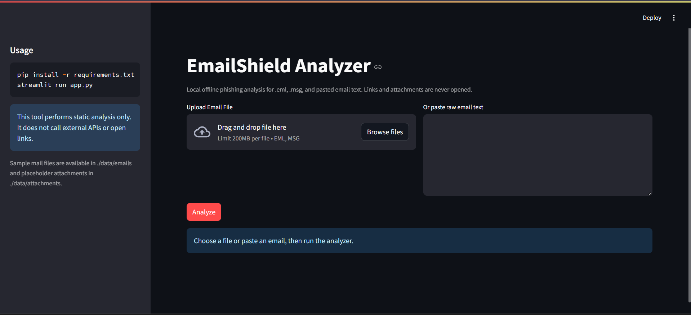

# PROBLEM 3 / 75
# 📧 EmailShield — Phishing Email Detector
### Rule-Based Risk Scoring + Header & Domain Analysis
### Identify phishing attempts before they trick you — automatically.
### No ML model needed. Heuristics + domain science do the work.

[](#)
[](https://python.org)
[](LICENSE)

---

## 😤 Why I Built This

Ek din ek email aaya — "Your SBI account has been suspended. Verify now." Link dekha, domain tha `sbi-secure-login.xyz`. Obviously fake tha — *lekin mujhe pata tha kyunki main tech field mein hoon.*

Mere parents ko nahi pata hota.

Phishing emails aaj kal itni convincing hoti hain — branded logos, urgent language, real-looking links. Ek click = account gone. Aur ye sirf bank alerts nahi hain. Fake OTP messages, prize winning scams, fake invoice attachments — sab kuch.

Existing tools ya toh paid hain ya kisi external server ko email bhejte hain. Main chahti thi ek tool jo **completely offline** kaam kare, koi data leak nahi, koi third-party API nahi — bas raw email paste karo aur instant analysis lo.

EmailShield wahi hai.

---

## 🧠 What is Rule-Based Risk Scoring?

EmailShield **heuristics + domain analysis** use karta hai — ek layered approach jo real-world phishing patterns ko detect karta hai bina kisi ML model train kiye.

Yeh 3 layers mein kaam karta hai:

1. **Header Analysis** — SPF/DKIM failures detect karta hai, sender vs Reply-To mismatch, suspicious relay chains
2. **Link & Domain Scoring** — IP-based URLs, URL shorteners, typosquatted domains (e.g. `paypa1.com`), encoded/obfuscated segments
3. **Attachment Risk** — Dangerous file types (`.exe`, `.js`, `.docm`, `.vbs`) flag karta hai jo macros ya scripts run kar sakti hain

> Sender: `alerts@paypa1.com` + Reply-To: `collect@randomdomain.ru` + Link: `bit.ly/win-prize` → **HIGH RISK**

Sab combine hoke ek **total risk score** nikalte hain. Score threshold define karta hai verdict: `SAFE`, `SUSPICIOUS`, ya `HIGH RISK`.

---

## 🔬 How the Risk Engine Works — The Science

Scoring is additive — har red flag score badhata hai:

**Header checks:**
```python
# SPF failure → +20 points
if "spf=fail" in auth_headers:
    score += 20

# Sender ≠ Reply-To domain → +20 points
if sender_domain != reply_to_domain:
    score += 20

# Long relay chain (≥6 hops) → +10 points
if len(received_chain) >= 6:
    score += 10
```

**Link checks:**
```python
# IP-based URL (e.g. http://192.168.1.1/login) → +30 points
if is_ip_hostname(hostname):
    score += 30

# Known URL shortener (bit.ly, tinyurl) → +20 points
if hostname in SHORTENER_DOMAINS:
    score += 20

# Typosquatting (paypa1 ≈ paypal, distance=1) → +30 points
if levenshtein_distance(label, brand) == 1:
    score += 30
```

**Verdict thresholds:**
```
score < 30   → SAFE
30 ≤ score < 60  → SUSPICIOUS
score ≥ 60   → HIGH RISK
```

No model training. No internet required. Pure heuristic intelligence that mirrors how a security analyst thinks.

---

## ✨ Features

| Section | What It Does |
|---------|-------------|
| 📋 **Email Summary** | Sender, Reply-To, Subject, attachment names — all parsed from raw `.eml` / `.msg` / pasted text |
| 🔗 **Link Analysis** | Every URL extracted, scored, and flagged — domain, root domain, risk score, and flag reason in a table |
| 📎 **Attachment Analysis** | Each attachment checked against dangerous extension list with per-file score and flag |
| 🛡️ **Header Warnings** | SPF/DKIM failures, sender mismatches, suspicious relay hops — all surfaced clearly |
| 🚨 **Threat Report** | Final risk score + color-coded verdict (`SAFE` / `SUSPICIOUS` / `HIGH RISK`) + full findings list |

**Supported formats:**
- ✅ `.eml` file upload (standard email format)
- ✅ `.msg` file upload (Outlook format)
- ✅ Paste raw email text directly
- ✅ Sample emails included in `data/emails/`

**Privacy:**
- 🔒 100% **offline** — no external API calls, no DNS lookups, no link following
- 🔒 Uploaded files processed in-memory, temp files deleted immediately
- 🔒 Zero data leaves your machine

---

## 🛠️ Tech Stack

| Layer | Tool |
|-------|------|
| Language | Python 3.10+ |
| Frontend | Streamlit |
| Email Parsing | Python `email` stdlib + `extract-msg` |
| Domain Analysis | `tldextract` (offline mode) |
| HTML Parsing | `beautifulsoup4` |
| Risk Engine | Custom rule-based scorer |
| Deployment | Streamlit Cloud |

---

## 📂 Project Structure

```
LV1_PROBLEM_3/
├── app.py                  # Main Streamlit interface
├── src/
│   ├── email_parser.py     # .eml / .msg / pasted text → ParsedEmail
│   ├── header_analyzer.py  # SPF, DKIM, relay chain checks
│   ├── link_analyzer.py    # URL extraction + per-URL risk scoring
│   ├── domain_analyzer.py  # Typosquat detection + domain heuristics
│   ├── risk_engine.py      # Aggregates scores → final RiskReport
│   └── utils.py            # Shared helpers (URL regex, HTML→text, etc.)
├── data/
│   ├── emails/             # Sample .eml files for testing
│   └── attachments/        # Sample attachments for demo
├── requirements.txt
└── README.md
```

---

## 🚀 Run Locally

```bash
# 1. Clone the repo
git clone https://github.com/aanxiee/75-day-ai-challenge.git
cd 75-day-ai-challenge/day-03-emailshield

# 2. Install dependencies (Python 3.10+ recommended)
pip install -r requirements.txt

# 3. Run
streamlit run app.py
```

App opens at `http://localhost:8501`

---

## 🌐 Live Demo

👉 **[Try the app live on Streamlit Cloud](#)** *(coming soon)*

Or try the **sample `.eml` files** in `data/emails/` — no real email needed!

---

## 💡 What I Learned

- **Rule-based systems beat ML for security heuristics at small scale** — you don't need training data to catch typosquatting or SPF failures. Explicit rules are auditable, explainable, and fast.
- **Email format is surprisingly complex** — `.eml`, `.msg`, multipart MIME, HTML bodies, base64 payloads. A lot of edge cases before parsing reliably works.
- **Levenshtein distance is surprisingly effective** — a distance of 1 catches `paypa1`, `micosoft`, `arnazon`. Simple math, real-world impact.
- **Offline-first is a feature, not a limitation** — most email analyzers call external APIs (VirusTotal, etc.). Being 100% offline means it works anywhere, privately.
- **Modular architecture pays off** — separating header/link/domain/attachment analysis meant I could test and tune each layer independently.

---

## 🔗 Links

- 🌐 Live App: *(coming soon)*
- 🐙 GitHub: [Aanya's Github](https://github.com/aanxiee)
- 💼 LinkedIn: [Check Profile](https://www.linkedin.com/in/aanya-mittal-aka-aanxiee/)
- 🌍 Website: [aanxiee](https://aanxiee.com)

---

## 📜 License

MIT — free to use, fork, and build upon.

---

*Day 03 / 75 — 75 Problems. 75 Real-World AI Solutions. #75DayAIChallenge*
